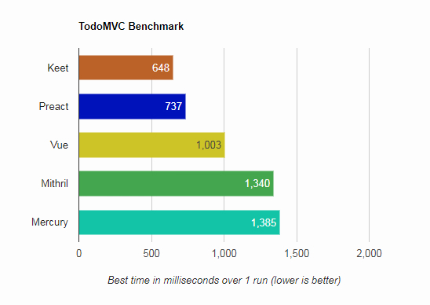
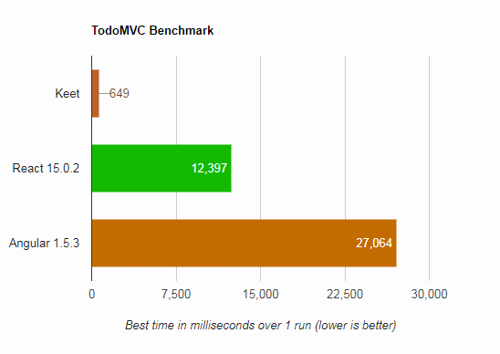

# Keet.js TodoMVC Example

[](https://travis-ci.org/syarul/cypress-example-todomvc)

This the implementation of TodoMVC using [keet](https://github.com/syarul/keet). 

> This TodoMVC is may serve as as an ***option*** of building application with Keet.js.

## Setup

To install run

```npm install```

To build and view the mvc

```npm run build```

## TodoMVC Performance Benchmark

> Opinionated, the benchmark test suite: [link](https://github.com/syarul/preact-perf#master)

Result vs Preact, Vue, Mithril and Mercury



It's about +/- 20x vs React and +/- 40x vs Angular



_( Results from Chrome v64 on Window 7 - AMD FX6100 - Radeon HD 7900 - )_

> 1000 Todos, all test without write to localStorage. Result varied across multiple test

## Test Unit

To run the todomvc test, clone https://github.com/syarul/cypress-example-todomvc

```npm install && npm start```

on different console run:-

```npm run cypress:run```
