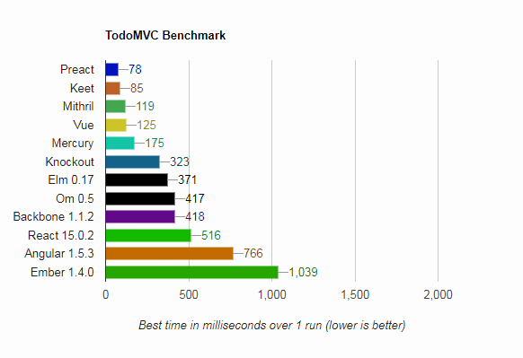

# Keet.js TodoMVC Example

> Keet.js is a lightweight view layer for the web, which take simplistic approach to handle data and DOM manipulation

## TodoMVC Performance Benchmark



_(Results for Chrome v64 on Window 7 Custom PC)_

> No write to localStorage for keet, mercury, preact and mithril. Result varied on multiple test

## Setup

To install run

```npm install```

To build and view the mvc

```npm run build```

## Test Unit

To run the todomvc test you need to copy this into the ```example``` tree folder of the offical todomvc at [github](https://github.com/tastejs/todomvc)

Name the folder into ```keetjs```, and follow the guide on how to setup the test.

## Resources

The [Keet.js at Github](https://github.com/syarul/keet) is a great resource for getting started.

_This TodoMVC is not the recommended way of building application with Keet.js._
